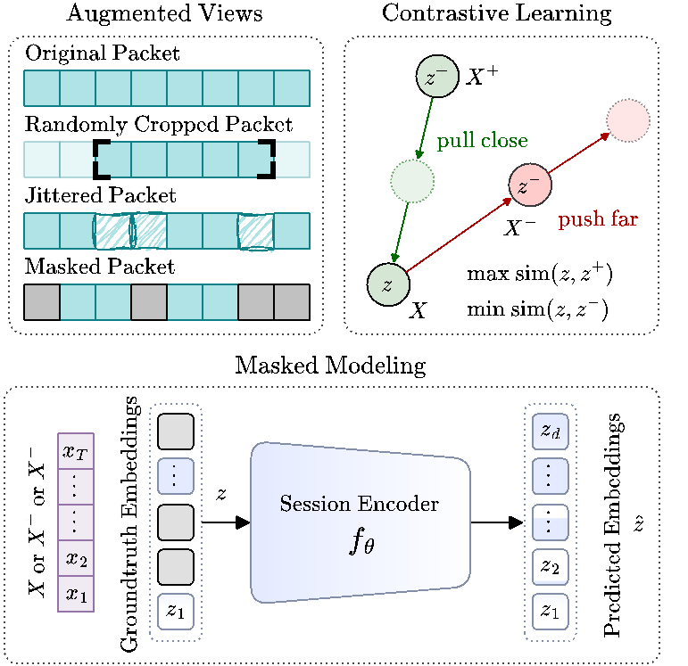
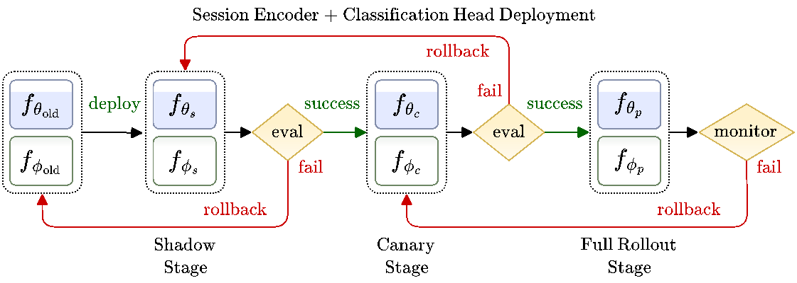
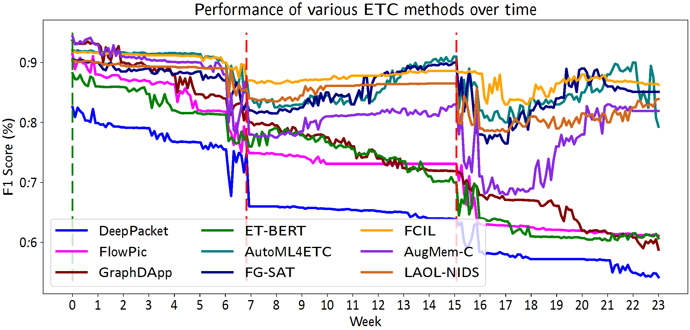
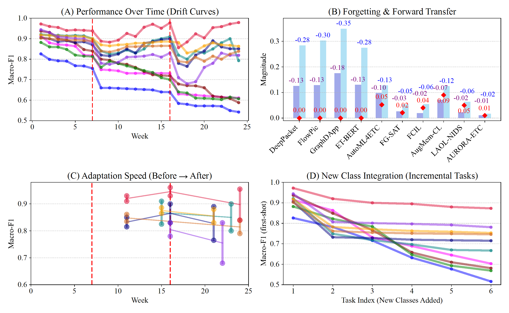

# AURORA-ETC: Lifelong Encrypted Traffic Classification

[](https://opensource.org/licenses/MIT)
[](https://www.python.org/downloads/)
[](https://pytorch.org/)

Official PyTorch implementation of **AURORA-ETC: Lifelong Encrypted Traffic Classification through Self-Supervised Pretraining and AutoML-Guided Adaptation**.

## Overview

AURORA-ETC is a lifelong learning framework for encrypted traffic classification that combines:
- **Self-supervised pretraining** on large-scale unlabeled TLS 1.3 and QUIC traffic
- **Lightweight online updates** using LoRA (Low-Rank Adaptation) and replay buffers
- **AutoML-guided reconfiguration** for severe drift scenarios
- **Protocol-aware drift sensing** for proactive adaptation

<p align="center">
  
  
  
</p>


## Features

- Two-tier adaptation: Fast LoRA updates for moderate drift, AutoML reconfiguration for severe drift
- Continual learning with minimal catastrophic forgetting
- Multi-signal drift detection (MMD, ECE, protocol telemetry)
- Resource-efficient: Low latency, high throughput, minimal memory overhead
- Privacy-preserving: Works on encrypted traffic features without payload inspection

## Pre-Installation
### 1. Download and install Wireshark
* While installing wireshark, CHECK the following option: Install Npcap in WinPcap API-compatible mode
### 2. Set Wireshark to environment variable
* In start menu search environment
* Edit the system environment variables > Environment Variables
* In user variable double-click Path
* Click New
* Paste the Wireshark installation path: (C:\Program Files\Wireshark)
* Click Ok > OK

## Installation

```bash
# Clone the repository
git clone https://github.com/aurora-etc/aurora-etc-pytorch.git
cd aurora-etc

# Create virtual environment
python -m venv venv
source venv/bin/activate  # On Windows: venv\Scripts\activate

# Install dependencies
pip install -r requirements.txt
```

<p align="center">
  
</p>

## Quick Start

### 1. Pretrain the Session Encoder

```bash
python scripts/pretrain.py --config configs/pretrain.yaml
```

### 2. Fine-tune on Labeled Data

```bash
python scripts/finetune.py --config configs/finetune.yaml --pretrained_checkpoint checkpoints/pretrained/encoder.pt
```

### 3. Run Lifelong Learning Pipeline

```bash
python scripts/run_lifelong.py --config configs/lifelong.yaml
```

<p align="center">
  
  
</p>


## Implementation Status

### ✅ Completed Components

#### 1. Core Models (`aurora_etc/models/`)
- **SessionEncoder**: Transformer-based encoder for processing encrypted traffic flows
  - Supports LoRA integration
  - Flexible pooling strategies (mean, CLS, max)
  - Configurable architecture (d_model, nhead, num_layers, etc.)

- **LoRALinear**: Low-Rank Adaptation implementation
  - Parameter-efficient fine-tuning
  - Configurable rank and alpha
  - Weight merging/unmerging support

- **ClassificationHead**: Classification head with optional cosine similarity
  - Standard and cosine-based classifiers
  - Configurable hidden layers

- **Transformer Components**: Positional encoding and transformer blocks

#### 2. Data Processing (`aurora_etc/data/`)
- **FlowPreprocessor**: Preprocesses packet sequences into feature vectors
- **PacketFeatureExtractor**: Extracts packet-level features (size, direction, IAT)
- **TrafficAugmentation**: Data augmentation for self-supervised learning
  - Random cropping
  - Jittering
  - Masking
- **Dataset Classes**: PyTorch Dataset implementations for encrypted traffic

#### 3. Drift Detection (`aurora_etc/drift/`)
- **DriftDetector**: Unified drift detection module
  - Combines MMD, ECE, uncertainty, and protocol telemetry
  - Configurable thresholds and weights
- **MMD Computation**: Maximum Mean Discrepancy for feature drift
- **ECE Computation**: Expected Calibration Error for confidence drift

#### 4. Training Modules (`aurora_etc/training/`)
- **Loss Functions**:
  - InfoNCE contrastive loss
  - Masked modeling loss
  - Knowledge distillation loss
- **Pretrainer**: Self-supervised pretraining loop
- **OnlineUpdater**: Lightweight online updates with LoRA
- **ReplayBuffer**: Buffer management for continual learning
  - Multiple selection strategies (uncertainty, random, class-balanced)

#### 5. AutoML Reconfiguration (`aurora_etc/automl/`)
- **AutoMLReconfigurator**: Bayesian optimization-based architecture search
  - Resource constraint checking (latency, memory, throughput)
  - Knowledge distillation integration
- **SearchSpace**: Configurable architecture search space

#### 6. Deployment (`aurora_etc/deployment/`)
- **DeploymentPipeline**: Staged deployment (shadow → canary → full)
  - SLO monitoring
  - Automatic rollback

#### 7. Utilities (`aurora_etc/utils/`)
- **Metrics**: Evaluation metrics (macro-F1, BWT, FWT, OOD AUROC)
- **Logging**: Logging utilities

#### 8. Training Scripts (`scripts/`)
- **pretrain.py**: Self-supervised pretraining script
- **finetune.py**: Supervised fine-tuning script
- **run_lifelong.py**: Lifelong learning pipeline script

#### 9. Configuration Files (`configs/`)
- **pretrain.yaml**: Pretraining configuration
- **finetune.yaml**: Fine-tuning configuration
- **lifelong.yaml**: Lifelong learning configuration

#### 10. Testing (`tests/`)
- Unit tests for models and drift detection


## Project Structure

```
aurora-etc/
├── aurora_etc/                    # Main package
│   ├── __init__.py               # Package initialization
│   │
│   ├── models/                   # Model architectures
│   │   ├── __init__.py
│   │   ├── encoder.py           # Session encoder (Transformer-based)
│   │   ├── lora.py              # LoRA (Low-Rank Adaptation) implementation
│   │   ├── classifier.py        # Classification head
│   │   └── transformers.py      # Transformer components
│   │
│   ├── data/                     # Data processing
│   │   ├── __init__.py
│   │   ├── datasets.py          # Dataset classes
│   │   ├── preprocessing.py     # Flow preprocessing
│   │   └── transforms.py        # Data augmentation
│   │
│   ├── drift/                    # Drift detection
│   │   ├── __init__.py
│   │   ├── detector.py          # Unified drift detector
│   │   ├── mmd.py               # Maximum Mean Discrepancy
│   │   └── calibration.py       # Expected Calibration Error (ECE)
│   │
│   ├── training/                 # Training modules
│   │   ├── __init__.py
│   │   ├── losses.py            # Loss functions (contrastive, masked, distillation)
│   │   ├── trainer.py           # Training loops (pretraining, online updates)
│   │   └── replay_buffer.py     # Replay buffer for continual learning
│   │
│   ├── automl/                   # AutoML reconfiguration
│   │   ├── __init__.py
│   │   ├── searcher.py          # Bayesian optimization search
│   │   └── search_space.py      # Architecture search space definition
│   │
│   ├── deployment/               # Deployment pipeline
│   │   ├── __init__.py
│   │   └── pipeline.py          # Shadow/canary/rollout deployment
│   │
│   └── utils/                    # Utilities
│       ├── __init__.py
│       ├── metrics.py           # Evaluation metrics (F1, BWT, FWT, etc.)
│       └── logging.py           # Logging utilities
│
├── scripts/                      # Training and evaluation scripts
│   ├── pretrain.py              # Self-supervised pretraining
│   ├── finetune.py              # Supervised fine-tuning
│   └── run_lifelong.py          # Lifelong learning pipeline
│
├── configs/                      # Configuration files
│   ├── pretrain.yaml            # Pretraining configuration
│   ├── finetune.yaml            # Fine-tuning configuration
│   └── lifelong.yaml            # Lifelong learning configuration
│
├── tests/                        # Unit tests
│   ├── __init__.py
│   ├── test_models.py           # Model tests
│   └── test_drift.py            # Drift detection tests
│
├── examples/                     # Example notebooks and scripts
│   └── (to be added)
│
├── docs/                         # Documentation
│   └── (to be added)
│
├── README.md                     # Main README
├── PROJECT_STRUCTURE.md          # This file
├── LICENSE                       # MIT License
├── requirements.txt              # Python dependencies
├── setup.py                      # Package setup
└── .gitignore                    # Git ignore rules
```


## Download and prepare the datasets
### 1. ISCX-VPN-NonVPN-2016
* Download the following files from the link:
http://205.174.165.80/CICDataset/ISCX-VPN-NonVPN-2016/Dataset/PCAPs/

```
1. NonVPN-PCAPs-01.zip
2. NonVPN-PCAPs-02.zip
3. NonVPN-PCAPs-03.zip
4. VPN-PCAPS-01.zip
5. VPN-PCAPS-02.zip
```
* Extract these following files in folder datasets/ISCX_VPN
* Finally the dataset structure should look like:
```
-datasets
 - ISCX_VPN
  - aim_chat_3a.pcap
  - aim_chat_3b.pcap
	...
  - youtubeHTML5_1.pcap
  - vpn_aim_chat1a.pcap
  - vpn_aim_chat1b.pcap
	...
  - vpn_youtube_A.pcap
```

### 2. ISCX-TOR
* Download page (PCAPs + CSV flows): Canadian Institute for Cybersecurity (UNB) Tor-nonTor dataset page https://www.unb.ca/cic/datasets/tor.html
* Extract into datasets/ISCX_TOR/
* Final folder structure (example):

```
datasets/
  ISCX_TOR/
    tor_browsing.pcap
    tor_email.pcap
    tor_voip.pcap
    nontor_browsing.pcap
    nontor_chat.pcap
    ...
    flows/
      TorNonTor-FlowMeter.csv   # if you use the provided CSV flows
```

### 3. CSTNET-TLS 1.3
* Download CSTNET-TLS 1.3 from the link referenced in ET-BERT's https://github.com/linwhitehat/ET-BERT.
* Place/rename files to match the packet/*.tsv paths used by ET-BERT (its examples call these exact filenames). 
```
datasets/
  CSTNET_TLS13/
    packet/
      train_dataset.tsv
      valid_dataset.tsv
      test_dataset.tsv
      nolabel_test_dataset.tsv   # optional, if provided
```

### 4. CESNET-QUIC22
* Download cesnet-quic22.zip (flows as CSV) and servicemap.csv from official dataset archive https://zenodo.org/records/10728760
* The Zenodo page includes schema, size, and per-week stats. 
* Extract into datasets/CESNET_QUIC22/
* Final folder structure:
```
datasets/
  CESNET_QUIC22/
    cesnet-quic22/
      week-2022-44.csv.gz
      week-2022-45.csv.gz
      week-2022-46.csv.gz
      week-2022-47.csv.gz
      dataset-statistics/...
    servicemap.csv
```

### 5. UCDavisQUIC
* Download Kaggle "UCDavisQUIC" (per-flow PCAPs organized by service) https://www.kaggle.com/datasets/guillaumefraysse/ucdavisquic?utm_source=chatgpt.com
* Extract into datasets/UCDAVIS_QUIC/
* Final folder structure:
```
datasets/
  UCDAVIS_QUIC/
    GoogleDocs/
      flow_00001.pcap
      ...
    GoogleDrive/
    GoogleMusic/
    GoogleSearch/
    YouTube/
```

### 6. WNL TLS
* Dataset datatset from "Novel QoS-aware TLS Dataset for Encrypted Traffic Classification" at https://wnlab.ru/qos-tls-dataset-of-enc-traffic/?utm_source=chatgpt.com
* Describes 3,547 flows across 12 services and 4 traffic types.
* Extract into datasets/WNL_TLS/
* Final folder structure (example):
```
datasets/
  WNL_TLS/
    raw_pcaps/
      service_A_*.pcap
      ...
    labels.csv          # if provided with service/type labels
```


## Component Descriptions

### Models (`aurora_etc/models/`)

- **encoder.py**: Transformer-based session encoder that processes encrypted traffic flows
- **lora.py**: Low-Rank Adaptation implementation for parameter-efficient fine-tuning
- **classifier.py**: Classification head with optional cosine similarity and margin-based loss
- **transformers.py**: Transformer building blocks (positional encoding, transformer blocks)

### Data Processing (`aurora_etc/data/`)

- **datasets.py**: PyTorch Dataset classes for encrypted traffic
- **preprocessing.py**: Flow preprocessing and feature extraction
- **transforms.py**: Data augmentation (cropping, jittering, masking) for self-supervised learning

### Drift Detection (`aurora_etc/drift/`)

- **detector.py**: Unified drift detector combining MMD, ECE, uncertainty, and protocol telemetry
- **mmd.py**: Maximum Mean Discrepancy computation for feature drift detection
- **calibration.py**: Expected Calibration Error for confidence drift detection

### Training (`aurora_etc/training/`)

- **losses.py**: Loss functions including InfoNCE contrastive loss, masked modeling loss, and knowledge distillation
- **trainer.py**: Training loops for pretraining and online updates
- **replay_buffer.py**: Replay buffer implementation for catastrophic forgetting prevention

### AutoML (`aurora_etc/automl/`)

- **searcher.py**: AutoML-guided reconfiguration using Bayesian optimization (Optuna)
- **search_space.py**: Architecture search space definition

### Deployment (`aurora_etc/deployment/`)

- **pipeline.py**: Staged deployment pipeline (shadow → canary → full rollout) with SLO monitoring

### Utilities (`aurora_etc/utils/`)

- **metrics.py**: Evaluation metrics (macro-F1, BWT, FWT, OOD AUROC)
- **logging.py**: Logging setup and utilities

## Workflow

1. **Pretraining** (`scripts/pretrain.py`): Train session encoder on unlabeled traffic using self-supervised learning
2. **Fine-tuning** (`scripts/finetune.py`): Fine-tune encoder and train classifier on labeled data
3. **Lifelong Learning** (`scripts/run_lifelong.py`): Run continuous adaptation pipeline with drift detection and online updates


## Results

### Longitudinal ISCX-VPN dataset

| Method         | Macro-F1 (W1) | Macro-F1 (W24) |     OOD AUROC |       ECE (%) |            BWT |           FWT |
| -------------- | ------------: | -------------: | ------------: | ------------: | -------------: | ------------: |
| DeepPacket     |     82.6±0.08 |      54.2±0.17 |     0.65±0.04 |     15.4±0.26 |     -0.13±0.07 |     0.00±0.00 |
| FlowPic        |     91.4±0.11 |      61.1±0.15 |     0.68±0.07 |     10.3±0.21 |     -0.13±0.09 |     0.00±0.00 |
| GraphDApp      |     93.7±0.10 |      58.8±0.19 |     0.70±0.05 |     7.90±0.22 |     -0.10±0.08 |     0.00±0.00 |
| ET-BERT        |     88.2±0.13 |      60.7±0.16 |     0.75±0.06 |     13.7±0.24 |     -0.13±0.10 |     0.00±0.00 |
| AutoML4ETC     |     92.1±0.09 |      79.9±0.18 |     0.77±0.05 |     8.50±0.26 |     -0.01±0.04 |     0.05±0.07 |
| FG-SAT         |     90.5±0.06 |      85.1±0.18 |     0.72±0.07 |     10.3±0.23 |     -0.03±0.09 |     0.02±0.11 |
| FCIL           |     91.8±0.14 |      86.3±0.17 |     0.72±0.06 |     9.60±0.27 |     -0.02±0.09 |     0.04±0.08 |
| AugMem-CL      | **94.4±0.05** |      81.9±0.14 | **0.82±0.04** | **7.80±0.18** |     -0.07±0.10 | **0.09±0.07** |
| LAOL-NIDS      |     90.3±0.11 |      83.9±0.16 |     0.79±0.08 |     11.2±0.22 |     -0.02±0.09 |     0.05±0.08 |
| **AURORA-ETC** | **97.2±0.05** |  **95.5±0.09** | **0.86±0.05** |  **5.2±0.17** | **-0.01±0.05** | **0.01±0.07** |


### Longitudinal ISCX-Tor dataset

| Method         | Macro-F1 (W1) | Macro-F1 (W24) |     OOD AUROC |       ECE (%) |            BWT |           FWT |
| -------------- | ------------: | -------------: | ------------: | ------------: | -------------: | ------------: |
| DeepPacket     |     78.2±0.07 |      48.9±0.12 |     0.61±0.06 |     17.7±0.18 |     -0.17±0.11 |     0.00±0.00 |
| FlowPic        |     86.3±0.10 |      56.2±0.15 |     0.63±0.08 |     11.9±0.15 |     -0.18±0.09 |     0.00±0.00 |
| GraphDApp      |     88.7±0.11 |      54.1±0.11 |     0.68±0.08 |     9.10±0.19 |     -0.23±0.13 |     0.00±0.00 |
| ET-BERT        |     83.6±0.12 |      55.9±0.13 |     0.77±0.10 |     15.8±0.16 |     -0.16±0.08 |     0.00±0.00 |
| AutoML4ETC     |     87.1±0.10 |      75.1±0.12 |     0.79±0.09 |     9.80±0.19 |     -0.03±0.07 |     0.06±0.02 |
| FG-SAT         |     85.5±0.09 |      80.3±0.16 |     0.72±0.09 |     11.8±0.17 |     -0.04±0.12 |     0.04±0.02 |
| FCIL           |     86.7±0.12 |      81.9±0.09 |     0.68±0.07 |     11.1±0.15 |     -0.04±0.11 |     0.02±0.02 |
| AugMem-CL      | **89.6±0.08** |      79.1±0.11 |     0.74±0.08 | **8.90±0.14** |     -0.09±0.09 | **0.11±0.01** |
| LAOL-NIDS      |     85.0±0.11 |      79.5±0.15 |     0.79±0.10 |     12.9±0.18 |     -0.04±0.12 |     0.07±0.10 |
| **AURORA-ETC** | **92.5±0.06** |  **90.3±0.09** | **0.82±0.06** | **6.30±0.15** | **-0.02±0.07** | **0.01±0.01** |

### Efficiency Comparison of AURORA-ETC and Baselines

| Method         |    Latency (p95/p99) [ms] | Throughput (flows/s) |  Memory (GB) | Update Cost (min) |
| -------------- | ------------------------: | -------------------: | -----------: | ----------------: |
| DeepPacket     |     1.77±0.03 / 2.31±0.05 |           238.1±0.23 |     2.4±0.05 |               N/A |
| FlowPic        |     1.69±0.04 / 2.05±0.02 |           198.8±0.17 |     2.0±0.07 |               N/A |
| GraphDApp      |     2.98±0.02 / 3.72±0.04 |       **409.8±0.20** |     4.1±0.06 |               N/A |
| ET-BERT        |     4.74±0.02 / 5.32±0.03 |           534.8±0.19 | **5.3±0.14** |               N/A |
| AutoML4ETC     |     3.68±0.05 / 3.85±0.04 |           416.7±0.24 |     4.2±0.05 |       **52±0.14** |
| FG-SAT         |     3.91±0.05 / 4.34±0.07 |           434.0±0.23 |     4.3±0.07 |           66±0.17 |
| FCIL           |     3.54±0.02 / 4.86±0.07 |           490.2±0.27 |     4.9±0.07 |           78±0.13 |
| AugMem-CL      |     2.29±0.05 / 2.59±0.06 |           298.5±0.10 |     3.5±0.09 |           35±0.09 |
| LAOL-NIDS      |     2.14±0.05 / 2.66±0.02 |           265.3±0.18 |     2.7±0.06 |           27±0.15 |
| **AURORA-ETC** | **1.98±0.03 / 2.62±0.02** |           242.4±0.17 |     2.4±0.04 |       **22±0.12** |

### Performance Before & After AutoML Reconfiguration (Severe Drift on QUIC)

| Condition                    |      Macro-F1 |     OOD AUROC |      ECE (%) | Latency (p99) [ms] |
| ---------------------------- | ------------: | ------------: | -----------: | -----------------: |
| Pre-Drift (initial model)    | **97.2±0.06** | **0.86±0.02** | **5.2±0.02** |      **1.89±0.02** |
| Post-Drift (before reconfig) |     79.3±0.07 |     0.72±0.04 |     9.3±0.05 |          2.15±0.03 |
| After Online Updates         |     83.5±0.05 |     0.77±0.05 |     7.8±0.03 |          2.40±0.05 |
| After AutoML Reconfig        | **95.5±0.03** | **0.82±0.05** | **6.1±0.06** |      **2.62±0.03** |

### Replay Buffer Size vs. Catastrophic Forgetting (ISCX-Tor)

| Buffer Size |  Macro-F1 (%) |            BWT |
| ----------- | ------------: | -------------: |
| 10k         |     84.2±0.09 |     -0.12±0.02 |
| **25k**     | **97.2±0.05** | **-0.01±0.01** |
| 50k         |     88.1±0.06 |     -0.03±0.02 |


## Citation

If you use this code in your research, please cite:

```bibtex
@article{aurora-etc2025,
  title={AURORA-ETC: Lifelong Encrypted Traffic Classification through Self-Supervised Pretraining and AutoML-Guided Adaptation},
  author={},
  journal={IEEE Transactions on Dependable and Secure Computing},
  year={2025}
}
```

## License

This project is licensed under the MIT License - see the [LICENSE](LICENSE) file for details.

