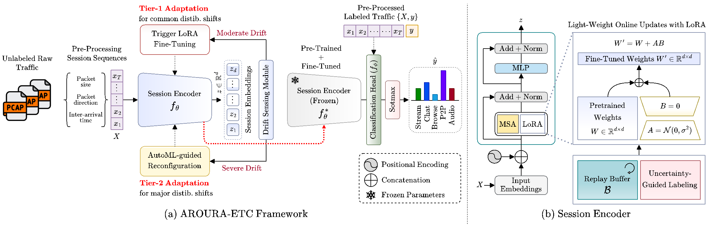

# AURORA-ETC: Lifelong Encrypted Traffic Classification

[](https://opensource.org/licenses/MIT)
[](https://www.python.org/downloads/)
[](https://pytorch.org/)

Official PyTorch implementation of **AURORA-ETC: Lifelong Encrypted Traffic Classification through Self-Supervised Pretraining and AutoML-Guided Adaptation**.

## Overview

AURORA-ETC is a lifelong learning framework for encrypted traffic classification that combines:
- **Self-supervised pretraining** on large-scale unlabeled TLS 1.3 and QUIC traffic
- **Lightweight online updates** using LoRA (Low-Rank Adaptation) and replay buffers
- **AutoML-guided reconfiguration** for severe drift scenarios
- **Protocol-aware drift sensing** for proactive adaptation

<p align="center">
  
</p>

## Features

- Two-tier adaptation: Fast LoRA updates for moderate drift, AutoML reconfiguration for severe drift
- Continual learning with minimal catastrophic forgetting
- Multi-signal drift detection (MMD, ECE, protocol telemetry)
- Resource-efficient: Low latency, high throughput, minimal memory overhead
- Privacy-preserving: Works on encrypted traffic features without payload inspection

## Installation

```bash
# Clone the repository
git clone https://github.com/yourusername/aurora-etc.git
cd aurora-etc

# Create virtual environment
python -m venv venv
source venv/bin/activate  # On Windows: venv\Scripts\activate

# Install dependencies
pip install -r requirements.txt
```

## Quick Start

### 1. Pretrain the Session Encoder

```bash
python scripts/pretrain.py --config configs/pretrain.yaml
```

### 2. Fine-tune on Labeled Data

```bash
python scripts/finetune.py --config configs/finetune.yaml --pretrained_checkpoint checkpoints/pretrained/encoder.pt
```

### 3. Run Lifelong Learning Pipeline

```bash
python scripts/run_lifelong.py --config configs/lifelong.yaml
```

## Project Structure

```
aurora-etc/
├── aurora_etc/
│   ├── models/          # Model architectures
│   ├── training/        # Training loops and losses
│   ├── drift/           # Drift detection modules
│   ├── automl/          # AutoML reconfiguration
│   ├── data/            # Data processing and loaders
│   ├── utils/           # Utilities and helpers
│   └── deployment/      # Deployment pipeline
├── scripts/             # Training and evaluation scripts
├── configs/             # Configuration files
├── tests/               # Unit tests
├── examples/            # Example notebooks and scripts
└── docs/                # Documentation
```

## Datasets

Supported datasets:
- ISCX-VPN
- ISCX-Tor
- CSTNET-TLS 1.3
- CESNET-QUIC22
- UCDavisQUIC
- WNL TLS

## Citation

If you use this code in your research, please cite:

```bibtex
@article{aurora-etc2025,
  title={AURORA-ETC: Lifelong Encrypted Traffic Classification through Self-Supervised Pretraining and AutoML-Guided Adaptation},
  author={},
  journal={IEEE Transactions on Dependable and Secure Computing},
  year={2025}
}
```

## License

This project is licensed under the MIT License - see the [LICENSE](LICENSE) file for details.

